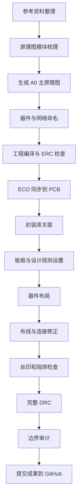

# EG4S20 BG256 核心板项目实践报告

日期：2026-07-09

## 1. 项目概述

本项目围绕安路 EG4S20BG256 FPGA 核心板展开，目标是在 Altium Designer 中完成从原理图整理、工程编译、封装关联、PCB 同步、布局布线到最终 DRC 检查的完整设计流程。最终工程文件可以在 Altium Designer 25.8.1 中打开、编辑和继续维护。

项目主工程：

```text
AltiumProject/EG4S20_SummerProject/EG4S20_SummerProject.PrjPcb
```

当前主原理图：

```text
AltiumProject/EG4S20_SummerProject/EG4S20BG256_CoreBoard_A0_NATIVE.SchDoc
```

当前 PCB：

```text
AltiumProject/EG4S20_SummerProject/EG4S20_CoreBoard.PcbDoc
```

最终检查结果：

- DRC：`Violations Detected = 0`
- Waived Violations：`0`
- primitive 越界：`0`
- component 越界：`0`
- 板框尺寸：`100 mm x 68 mm`

## 2. 设计目标

本次实践的核心目标不是只画一张示意图，而是形成一套可编译、可同步、可检查、可继续出板准备的 Altium 工程。

具体目标包括：

1. 依据参考 PDF 和已有分模块原理图，整理出 A0 尺寸主原理图。
2. 保证原理图中的元器件是 Altium 原生对象，可以逐个编辑。
3. 完成关键网络命名和 FPGA 管脚映射。
4. 通过工程编译，消除阻塞性原理图 error。
5. 将原理图通过 ECO 同步到 PCB。
6. 关联 PCB 封装库，解决 Footprint Not Found 问题。
7. 按参考板进行器件布局，建立合理板框和生产规则。
8. 完成布线修正，清理短路、未连接、天线线头、丝印冲突等问题。
9. 运行完整 DRC 和边界审计，确认 PCB 当前状态可展示、可继续制造前检查。

## 3. 资料和工具准备

### 3.1 参考资料

项目使用的主要资料包括：

```text
EG4S20BG256核心板 - 2023.pdf
大拇指安路EG4S20 - 板卡和开发工具入门.pdf
史万周小学期上机2026 给学生.doc
ANLOGIC开发板封装库.IntLib
```

其中，`EG4S20BG256核心板 - 2023.pdf` 用于确认核心板功能、主要器件和连接关系；封装库用于为原理图中的器件匹配 PCB Footprint。

### 3.2 软件环境

本项目主要使用：

- Altium Designer 25.8.1
- Git / GitHub
- PowerShell 辅助脚本
- Altium Script 辅助自动化

Altium Script 主要用于重复性操作，例如 PCB 边界审计、连接修正、丝印检查和 DRC 启动。脚本不是最终设计本身，但提高了检查和修正效率。

## 4. 总体流程



## 5. 原理图设计过程

### 5.1 原理图结构整理

项目早期存在多张分模块原理图：

```text
02_FPGA_Clock_Flash.SchDoc
03_USB_JTAG.SchDoc
04_UserIO.SchDoc
05_Power.SchDoc
```

这些文件保留为参考资料。为了便于展示和统一编译，当前工程采用单页 A0 主原理图作为主输入：

```text
EG4S20BG256_CoreBoard_A0_NATIVE.SchDoc
```

这种处理方式的优点是展示时更直观，所有主要模块可以在一张图中看到；同时避免旧分页面原理图重复参与编译，造成重复网络或历史 warning 干扰。

### 5.2 原理图对象生成方式

实践中曾尝试过直接生成或修改 `.SchDoc` 二进制文件，但这种方式不稳定，容易出现空白图纸、对象挤压、打开卡死等问题。最终采用 Altium 自身 API 创建和复制原生对象，保证生成文件可以被 Altium 正常打开和编辑。

这一阶段的经验是：Altium 原理图和 PCB 文件属于复杂工程文件，不能把它当成普通文本或简单二进制文件拼接。稳定做法是通过 Altium 内部机制创建、复制、保存对象。

### 5.3 功能模块划分

原理图按功能划分为以下模块：

| 模块 | 主要内容 |
|---|---|
| FPGA 核心 | EG4S20BG256 主芯片、电源脚、配置和 IO |
| 时钟与 Flash | 主时钟晶振、SPI Flash、配置网络 |
| USB/JTAG/UART | USB 接口、USB 转串口、JTAG 调试相关网络 |
| 用户 IO | LED、拨码开关、矩阵按键、数码管、蜂鸣器 |
| 电源 | VIN_5V、VCC_3V3、VCC_1V2、ADC_VDDA、GND |

### 5.4 关键网络和管脚映射

原理图阶段的重点之一是给关键网络设置明确名称，方便后续 PCB 同步和检查。

FPGA 已录入的主要管脚映射如下：

| 功能 | 管脚 / 网络 |
|---|---|
| 拨码开关 | A9、A10、B10、A11、A12、B12、A13、A14 |
| LED | B14、B15、B16、C15、C16、E13、E16、F16 |
| 数码管段选 | A4、A6、B8、E8、A7、B5、A8、C8 |
| 数码管位选 | C9、B6、A5、A3 |
| 蜂鸣器 | H11 |
| 时钟 | R7 |
| 矩阵键盘列 | F10、C11、D11、E11 |
| 矩阵键盘行 | E10、C10、F9、D9 |
| UART | RXD=F12，TXD=D12 |

电源网络确认如下：

```text
VCCINT  -> VCC_1V2
VCCAUX  -> VCC_3V3
VCCO_0  -> VCC_3V3
VCCO_1  -> VCC_3V3
VCCO_2  -> VCC_3V3
VCCO_3  -> VCC_3V3
ADC_VDDA -> FB1 输出侧
GND     -> 全板公共地
```

通信和配置网络包括：

```text
SPI_CS
SPI_CLK
SPI_MOSI
SPI_MISO
USB_D+
USB_D-
UART_RXD_F12
UART_TXD_D12
JTAG_TCK
JTAG_TMS
JTAG_TDI
JTAG_TDO
```

### 5.5 原理图编译检查

完成器件摆放、网络标签、Designator 修正和必要 No ERC 处理后，执行工程编译和 Validate。最终原理图达到：

```text
Compile successful, no errors found.
```

当时仍存在少量 warning，例如部分网络被 Altium 判断为没有驱动源、电源网络包含 IO Pin 和 Power Pin。这些 warning 不代表连接错误，且不阻塞 PCB 同步；后续可以通过 pin 类型、Power Port 或 No ERC 进一步整理。

## 6. 原理图到 PCB 的同步

### 6.1 ECO 同步

原理图编译无 error 后，在 Altium 中执行：

```text
Design > Update PCB Document EG4S20_CoreBoard.PcbDoc
```

ECO 流程包括：

```text
Validate Changes
Execute Changes
```

ECO 的 Check 和 Done 列均通过后，PCB 文档中出现从原理图同步过来的元器件、网络飞线和封装信息。

### 6.2 封装库关联

项目使用的主要封装库包括：

```text
AltiumProject/CompatLibrary/EG4S20BG256.PcbLib
AltiumProject/CompatLibrary/YQPOWER.PcbLib
AltiumProject/CompatLibrary/ControlCircuit_PCB_Library_V1_0.PcbLib
ANLOGIC开发板封装库.IntLib
```

实践中遇到过 Footprint Not Found 问题。原因主要是原理图模型条目、库路径和封装名称未完全匹配。处理时优先使用工程内明确存在的 PCB 库，并将中文命名库复制为 ASCII 文件名，降低路径编码和库名识别风险。

## 7. PCB 设计过程

### 7.1 板框建立与校正

最终 PCB 板框参数为：

```text
100 mm x 68 mm
```

最终边界审计记录：

```text
Expected board: 100 mm x 68 mm
Primitive count: 1548
Outside primitive count: 0
Component count: 24
Outside component count: 0
```

这说明当前元器件和 PCB 图元均没有超出板框。

### 7.2 生产规则设置

PCB 设计规则按基础制造能力设置：

| 项目 | 规则 |
|---|---|
| 最小间距 | 5 mil |
| 走线最小宽度 | 5 mil |
| 走线优选宽度 | 6 mil |
| 走线最大宽度 | 10 mil |
| 过孔外径 | 约 16 mil |
| 过孔孔径 | 约 12 mil |
| 阻焊桥 | 3 mil |

阻焊桥规则最终设为 `3mil`，是为了适配当前 BGA 和细间距封装，避免使用不现实的 10 mil 规则造成大量误报。

### 7.3 器件布局

PCB 布局参考实物核心板正反面图片，并遵循功能块集中原则：

- FPGA 位于核心区域，便于向各外设扇出。
- Flash 靠近 FPGA 的 SPI 管脚，减少配置线长度。
- 晶振靠近对应时钟输入脚，时钟线尽量短。
- USB、JTAG、UART 相关器件靠近接口侧。
- LED、拨码开关、数码管、按键和蜂鸣器放在便于观察和操作的位置。
- 电源器件集中摆放，减少 VIN_5V、VCC_3V3、VCC_1V2 的绕线距离。

布局过程中曾发现右侧接口存在越界风险，后续将接口整体移入板框，并通过边界审计确认无越界对象。

### 7.4 布线和连接修正

PCB 初步布线后，继续检查 Connection 对象和 DRC。主要处理包括：

1. 补齐剩余 GND 短连接。
2. 补齐 JTAG 相关连接。
3. 删除不再需要的 GND stub。
4. 删除天线线头。
5. 清理丝印压焊盘、丝印重叠和默认重复 `Designator1` 文本。

这些修正确保最终没有未连接网络、短路、天线线头和丝印规则违规。

### 7.5 丝印与阻焊处理

丝印检查中发现部分顶层或底层丝印对象与焊盘、阻焊窗口或其他丝印发生冲突。处理方式是删除无实际展示价值的重复或越界丝印对象，而不是盲目移动所有丝印。

最终处理内容包括：

- 删除底层靠近 U10 的冲突丝印。
- 删除顶层靠近 U1 的冲突丝印和 polyregion。
- 删除连接器区域冲突的顶层 overlay 线段。
- 删除原点附近两个重复默认 `Designator1` 文本。

处理后：

```text
Silk To Solder Mask => 0
Silk to Silk => 0
```

## 8. 最终 DRC 结果

最终 DRC 报告文件：

```text
AltiumProject/EG4S20_SummerProject/Design Rule Check - EG4S20_CoreBoard.drc
```

报告时间：

```text
2026-07-09 22:37:09
```

主要规则结果如下：

| DRC 规则 | 违规数量 |
|---|---:|
| Clearance Constraint | 0 |
| Short-Circuit Constraint | 0 |
| Un-Routed Net Constraint | 0 |
| Modified Polygon | 0 |
| Width Constraint | 0 |
| Routing Topology Rule | 0 |
| Power Plane Connect Rule | 0 |
| Hole Size Constraint | 0 |
| Hole To Hole Clearance | 0 |
| Minimum Solder Mask Sliver | 0 |
| Silk To Solder Mask | 0 |
| Silk to Silk | 0 |
| Net Antennae | 0 |
| Height Constraint | 0 |

总结：

```text
Violations Detected : 0
Waived Violations   : 0
```

## 9. 项目成果

最终形成的主要成果包括：

| 类型 | 文件 |
|---|---|
| Altium 工程 | `AltiumProject/EG4S20_SummerProject/EG4S20_SummerProject.PrjPcb` |
| 主原理图 | `AltiumProject/EG4S20_SummerProject/EG4S20BG256_CoreBoard_A0_NATIVE.SchDoc` |
| PCB 文件 | `AltiumProject/EG4S20_SummerProject/EG4S20_CoreBoard.PcbDoc` |
| DRC 报告 | `AltiumProject/EG4S20_SummerProject/Design Rule Check - EG4S20_CoreBoard.drc` |
| HTML DRC 报告 | `AltiumProject/EG4S20_SummerProject/Design Rule Check - EG4S20_CoreBoard.html` |
| PCB 辅助脚本 | `AltiumProject/PCB_AutoLayout_Route.pas` |
| DRC 启动脚本 | `AltiumProject/PCB_Run_DRC.pas` |
| 边界审计脚本 | `AltiumProject/PCB_Boundary_Audit.PrjScr` |

当前成果已经提交到 GitHub：

```text
03793df Finalize PCB DRC and boundary cleanup
```

## 10. 实践中遇到的问题和解决方法

| 问题 | 处理方法 |
|---|---|
| 直接生成 `.SchDoc` 不稳定 | 改用 Altium API 创建和复制原生对象 |
| 中文或特殊路径导致脚本路径异常 | 优先使用 ASCII 路径和工程内固定路径 |
| Footprint Not Found | 统一封装库来源，使用工程内可识别 PcbLib |
| PCB 板框曾有越界风险 | 调整板框和器件位置，并运行边界审计 |
| 自动布线后存在剩余短飞线 | 针对 GND/JTAG 补线并复查 connection |
| 丝印压焊盘和丝印重叠 | 删除无价值冲突丝印，保留必要标识 |
| 右侧接口自由焊盘存在短路/阻焊桥风险 | 归一网络、移动阻焊桥焊盘并删除多余自由短路对象 |

## 11. 可展示讲解要点

展示时可以按以下顺序讲：

1. **项目目标**：完成 EG4S20BG256 核心板从原理图到 PCB 的完整 Altium 工程。
2. **原理图阶段**：整理 A0 主图，完成模块划分、网络命名、FPGA 管脚映射和编译检查。
3. **同步阶段**：通过 ECO 将原理图元件和网络同步到 PCB。
4. **封装阶段**：关联 FPGA、接口、电源和外设封装库，解决 Footprint 识别问题。
5. **PCB 阶段**：设置板框和生产规则，按功能块进行器件布局和布线。
6. **修正阶段**：清理未连接、短路风险、天线线头、丝印冲突和阻焊规则问题。
7. **验证阶段**：最终 DRC 为 0，边界审计确认元器件和走线没有超出板框。

## 12. 后续优化方向

当前工程已经满足展示和继续出板前准备的基础要求。若后续按更高制造标准推进，可以继续优化：

1. 对 USB_D+ / USB_D- 做差分阻抗、线长和间距控制。
2. 对 GND Polygon Pour 做进一步检查，关注孤岛铜和回流路径。
3. 输出 Gerber X2、NC Drill、BOM 和装配图。
4. 结合具体板厂工艺复核 BGA、USB、SOP 等细间距封装焊盘。
5. 做一次人工目检，重点检查接口方向、丝印可读性和器件装配空间。

## 13. 总结

本项目完成了从参考资料整理、原理图设计、工程编译、ECO 同步、封装关联、PCB 布局布线到 DRC 验证的完整流程。最终 PCB 已保存，DRC 违规为 0，板框边界审计显示元器件和 PCB 图元均未越界。

通过本次实践，可以完整展示一个 FPGA 核心板设计从电路逻辑到可检查 PCB 文件的落地过程，也保留了后续制造文件输出和高速信号优化的继续空间。
